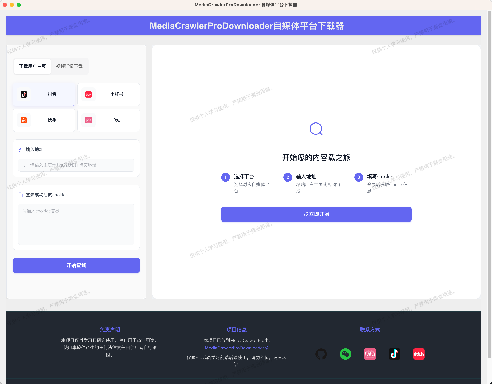

## 免责声明
> 本项目的所有内容仅供学习和参考之用，禁止用于商业用途。任何人或组织不得将本仓库的内容用于非法用途或侵犯他人合法权益。
> 
> 点击查看更为详细的免责声明。[点击跳转](#disclaimer)

## MediaCrawler Pro版本诞生的背景
[MediaCrawler](https://github.com/NanmiCoder/MediaCrawler)这个项目开源至今获得了大量的关注，同时也暴露出来了一系列问题，比如：
- 能否支持多账号？
- 能否支持断点续爬？
- 能否在linux部署？
- 能否去掉playwright的依赖？
- 有没有更简单的部署方法？
- 有没有针对新手上门槛更低的方法？

诸如上面的此类问题，想要在原有项目上去动刀，无疑是增加了复杂度，可能导致后续的维护更加困难。
出于可持续维护、简便易用、部署简单等目的，对MediaCrawler进行彻底重构。

## 项目介绍
### [MediaCrawler](https://github.com/NanmiCoder/MediaCrawler)的Pro版本python实现
**小红书爬虫**，**抖音爬虫**， **快手爬虫**， **B站爬虫**， **微博爬虫**，**百度贴吧**，**知乎爬虫**...。

支持多种平台的爬虫，支持多种数据的爬取，支持多种数据的存储，最重要的**完美支持多账号+IP代理池，让你的爬虫更加稳定**。
相较于MediaCrawler，Pro版本最大的变化：
- 增加断点续爬的功能，恢复上次爬取的进度。
- 多账号+IP代理池的支持，让爬虫更加稳定。
- 去掉了playwright的依赖，不再将Playwright集成到爬虫主干中，依赖过重。
- 新增签名服务，解耦签名逻辑，让爬虫更加灵活。
- 新增自媒体平台视频下载器桌面端UI下载项目（适合全栈项目学习）。
- 支持多个平台的首页信息流推荐（HomeFeed）

## 功能列表
| 平台 | 断点续爬 | 关键词搜索 | 指定帖子ID爬取 | 二级评论 | 创作者主页 | 首页推荐信息流 |账号池+IP代理池 | 
|----|------|-------|----------|------|-------|--------|-----------|
| 小红书 | ✅    | ✅     | ✅        | ✅    | ✅    | ✅      | ✅        |
| 抖音 | ✅    | ✅     | ✅        | ✅    | ✅     | ✅      | ✅         |
| 快手 | ✅    | ✅     | ✅        | ✅    | ✅     | ✅      |✅         |
| B 站 | ✅    | ✅     | ✅        | ✅    | ✅     | ✅      | ✅         |
| 知乎 | ✅     | ✅     | ✅        | ✅    | ✅     | ✅      |✅         |
| 微博 | ✅    | ✅     | ✅        | ✅    | ✅     | ❌      | ✅         |
| 贴吧 | ✅    | ✅     | ✅        | ✅    | ✅     | ❌       | ✅         |

## 获取Pro版本的访问权限
> 如果感兴趣可以加我微信，订阅Pro版本访问权限哦，有门槛💰。 
> 
> ⚠️⚠️仅针对个人想学习Pro版本源码实现的用户，如果是公司或者商业化盈利性质的就不要加我了，谢谢🙏
> 
> 代码设计拓展性强，可以自己扩展更多的爬虫平台，更多的数据存储方式，相信对你架构这种爬虫代码有所帮助。

扫描下方我的个人微信，备注：pro版本（如果图片展示不出来，可以直接添加我的微信号：relakkes）
> 如果添加我微信显示频繁添加的话，可以尝试添加这个微信号：relakkes2

  

## Pro源代码仓库学习列表

- 🧹 **MediaCrawlerPro-Python**: 开源项目MediaCrawler的重构，移除playwright、增加多账号IP代理、代码优化.
- 🎯 **MediaCrawlerPro-SignSrv**: 爬虫JS签名逻辑单独抽出来作为最底层依赖服务.
- 🔗 **MediaCrawlerPro-Downloader**: 新开发的自媒体平台视频（图片）下载器，一个全栈项目，包含前端+后端+爬虫，适合学习全栈开发.
- 🛠️ **MediaCrawlerPro-Golang**: Golang语言版本，目前实现了最基本的xhs流程，开发中 .

### MediaCrawlerPro-Downloader视频下载器UI截图
> 前端：electorn + vue3 + ts + vite + elementui-plus。后端：Python+Tornado+Httpx+Pydantic

## 更新日志
- [x] 账号池管理 & 支持excel和mysql两种方式
- [x] 小红书爬虫重构
- [x] 微博爬虫重构
- [x] 百度贴吧爬虫重构
- [x] B站爬虫重构
- [x] 抖音爬虫重构
- [x] 快手爬虫重构
- [x] Pro版本使用教程视频录制
- [x] 知乎关键词爬虫支持
- [x] 知乎创作者主页爬虫支持
- [x] 知乎指定帖子支持
- [x] 账号池管理再次重构
- [x] 知乎支持爬取一个问答下的所有回答
- [x] MediaCrawlerPro-Downloader视频下载器开发完成
- [x] 知乎支持断点续爬
- [ ] MediaCrawlerPro-AI功能开发

## 免责声明

 

### 1. 项目目的与性质
本项目（以下简称“本项目”）是作为一个技术研究与学习工具而创建的，旨在探索和学习网络数据采集技术。本项目专注于自媒体平台的数据爬取技术研究，旨在提供给学习者和研究者作为技术交流之用。

### 2. 法律合规性声明
本项目开发者（以下简称“开发者”）郑重提醒用户在下载、安装和使用本项目时，严格遵守中华人民共和国相关法律法规，包括但不限于《中华人民共和国网络安全法》、《中华人民共和国反间谍法》等所有适用的国家法律和政策。用户应自行承担一切因使用本项目而可能引起的法律责任。

### 3. 使用目的限制
本项目严禁用于任何非法目的或非学习、非研究的商业行为。本项目不得用于任何形式的非法侵入他人计算机系统，不得用于任何侵犯他人知识产权或其他合法权益的行为。用户应保证其使用本项目的目的纯属个人学习和技术研究，不得用于任何形式的非法活动。

### 4. 免责声明
开发者已尽最大努力确保本项目的正当性及安全性，但不对用户使用本项目可能引起的任何形式的直接或间接损失承担责任。包括但不限于由于使用本项目而导致的任何数据丢失、设备损坏、法律诉讼等。

### 5. 知识产权声明
本项目的知识产权归开发者所有。本项目受到著作权法和国际著作权条约以及其他知识产权法律和条约的保护。用户在遵守本声明及相关法律法规的前提下，可以下载和使用本项目。

### 6. 最终解释权
关于本项目的最终解释权归开发者所有。开发者保留随时更改或更新本免责声明的权利，恕不另行通知。

